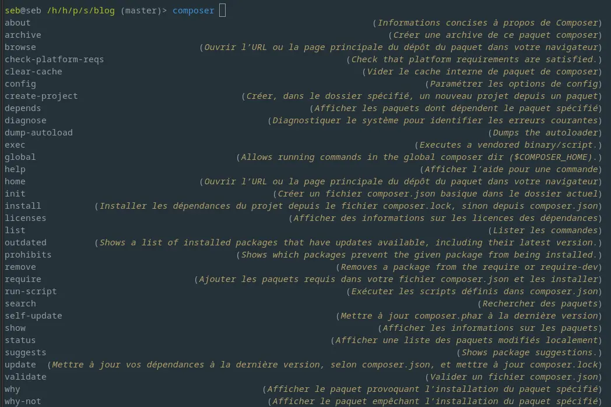
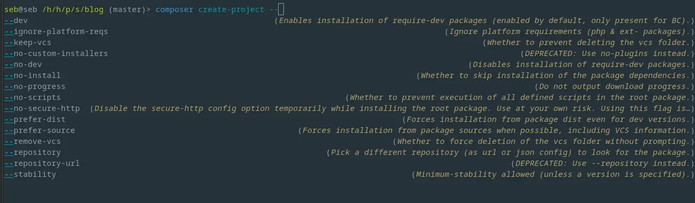
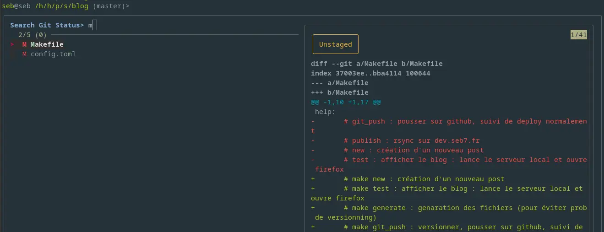
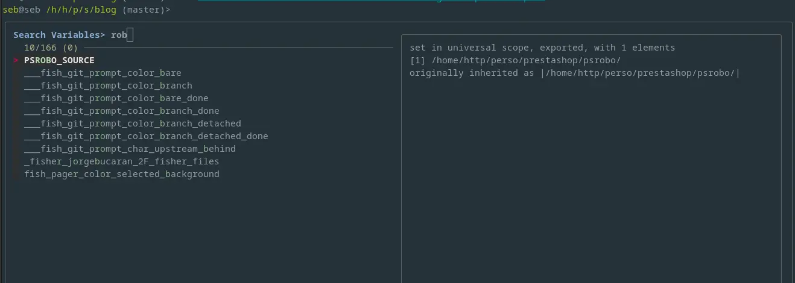

Un terminal bien configuré, c'est indispensable pour un développeur.  
J'ai longtemps utilisé un simple bash, puis zsh et je viens de passer sous [fish](https://fishshell.com/).

<!--more-->

D'après la doc :

> fish is a smart and user-friendly command line
> shell for Linux, macOS, and the rest of the family.

et c'est tout à fait vrai.

## Quelques points forts de Fish

- Est prêt à l'emploi _out of the box_ sans ajouter de plugins ou autre `oh my zsh`.
- une autocomplétion remarquable, qui présente les options et leur documentation
- une facilité de customisation inégalée ([fonctions](https://fishshell.com/docs/current/language.html#syntax-function), [abbréviation](https://fishshell.com/docs/current/cmds/abbr.html) pour taper plus vite sans cacher les commandes, une gestion des variables d'environnement simplifiée, ...)
- le gestionnaire de plugins [fisher](https://github.com/jorgebucaran/fisher) et des plugins _whaoo_ !

## Plaisant à coder - Fonctions vs Configurations

Plus de commandes, moins de configurations dans la philosophie de `fish`.
ça permet d'installer, de modifier sa configuration facilement, sans se tromper et de tout scripter simplement.
Pour définir un alias, vous n'allez pas modifier un fichier de configuration mais taper une commande. Ça permet une validation instantanée par fish, avant même exécution, ça permet d'utiliser l'autocomplétion comme une aide et ça permet de faire des scripts des plugins de façon très fluide.

Par exemple pour définir une fonction qui va convertir toutes les images .png du dossier courant au format webp, je tape `function toweb`, ça m'ouvre un éditeur, à la sortie de l'éditeur fish vérifie qu'il n'y a pas de problème de syntaxe. Quand je suis satisfait de ma function, je tape `funcsave toweb` et la fonction est enregistrée dans un fichier pour être dispo dans les prochaines sessions.  
Dans ce fichier la fonction ressemble à ça :

```shell
function towebp --description 'converti les fichiers png en webp'
  for f in *.png
    set out (string replace -r '.png$' '.webp' "$f")
    convert "$f" "$out"
  end
end
```

Vous noterez la [boucle for](https://fishshell.com/docs/current/language.html#syntax-loops-and-blocks), la [commande set](https://fishshell.com/docs/current/cmds/set.html) et [string replace](https://fishshell.com/docs/current/cmds/string-replace.html) qui sont fournis par fish.
C'est élégant, bien plus plaisant à écrire que du bash de base, et parfaitement documenté.

## L'autocomplétion

Je vous mets quelques captures, ça sera plus parlant :






Pour être vraiment efficace, il faut aussi connaitre les raccourcis de base du terminal (CTRL+a, CRTL+o, etc).
Vous ne les connaissez pas ? `fish_config browse` (ouvre un navigateur avec toutes les config), voir la section 'bindings' qui liste tout.

## Quelques plugins

J'ai actuellement seulement 3 plugins :

- [fisher](https://github.com/jorgebucaran/fisher), qui est le gestionnaire de plugin lui même.
- [wd](https://github.com/mfaerevaag/wd-fish) qui permet de naviguer rapidement dans les dossiers.
- [fzf](https://github.com/patrickf1/fzf.fish) qui met l'autocomplétion et la recherche à un niveau incroyable (ultra rapide avec prévisualisation)

## Pour finir

J'ai commencé à ajouter des alias et fonctions, et je reprends ceux que j'avais avec zsh.  
Pour rendre son terminal productif et plaisant à utiliser, je vous recommande fortement `fish`, oubliez `zsh`.
