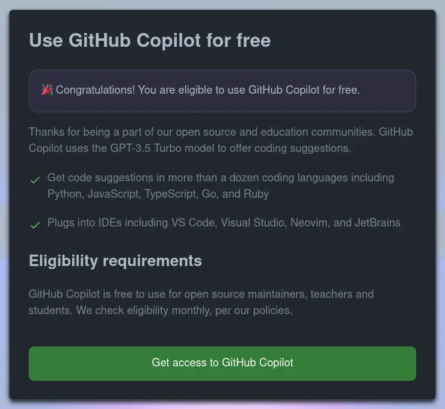

J'ai voulu repayer GitHub Copilot mais c'était gratuit :)

<!--more-->

J'ai utilisé GitHub Copilot quelques mois pour mon compte personnel.  
J'ai arrêté mon abonnement cet été.
J'ai recodé sans cette IA, mais tout de même, c'est bien pratique.

## Digression - opinion rapide sur Copilot

Non seulement c'est bien pratique mais ce copilot me fais des suggestions intelligentes, sur des points que je n'ai pas encore anticipés.
Il m'est arrivé de corriger une fonction générée, elle était trop complexe, je n'avais pas besoin des paramètres que copilote a ajoutés.  
Puis quelques minutes plus tard, j'ai vu que ma fonction devait être modifiée (c'est un processus normal, on code juste ce qui est utile)...
Pour revenir à ce Copilot m'avait proposé !

Je ne m'étends pas dessus, en deux mots, ce que j'en pense, c'est que c'est un très bon outil.  
Comme tous les outils, il faut savoir l'utiliser correctement et avoir du recul sur ce qu'il produit.

## Retour à nos moutons

Pour en revenir au sujet de cette note, j'ai décidé de reprendre un abonnement et j'ai vu ce message :

Je vous avouerai que je n'ai bien identifié la raison de cette gratuité.  
Soit ce sont mes activités opensource, mais elles sont réduites.  
Soit c'est mon pack GitHub Student que j'ai activé récemment ([formation PHP/Symfony](/post/2023-11-09/j-entame-une-formation-symfony/)), mais je n'ai fais que l'activé et rien d'autre...

Qu'importe, profitons en :)

> Edit, je sais maintenant que c'est lié au _student pack_.
