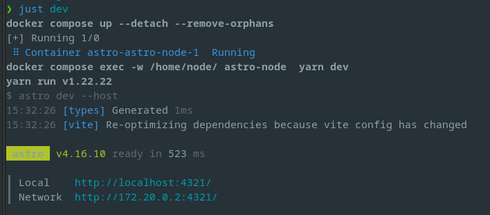

Je me forme actuellement aux technologies JavaScript _front end_. Et mon blog ne me convenait plus vraiment (design, édition). Pour faire d'une pierre, deux coups, j'ai migré ce blog de [Hugo](https://gohugo.io/) vers [Astro](https://astro.build/).  
Je suis satisfait de cette migration, j'ai maintenant un thème plus agréable, un rendu plus performant, je peux facilement le modifier et ça m'a permis de mettre en action quelques nouvelles compétences en JavaScript / ReactJs.

Je fais d'abord un retour d'expérience sur Hugo, puis je donne une impression à chaud d'Astro.

## Les limites d'Hugo

### La documentation

Rédiger une documentation de qualité est une tâche ardue, il faut être simple sans être réducteur, complet sans être rébarbatif. Pour un projet public, il faut répondre à des besoins relativement différents, c'est un challenge supplémentaire.  
Le _get started_ est trop minimaliste à mon goût, à l'opposé, la documentation détaillée n'est pas assez pratique et beaucoup de questions restent ouvertes, de mémoire.  
Comme j'ai une connaissance très superficielle du langage Go et du code de Hugo, il a été difficile d'y faire des modifications.

### La syntaxe des templates

J'aime bien le code expressif, qu'on peut lire en langage naturel, j'essaie de coder de cette façon le plus possible.  
Le moteur de template d'Hugo est ([text/template](https://pkg.go.dev/text/template)). Pour distinguer deux types de post dans les listings, j'ai dû modifier un template, le code produit était le suivant.

```twig
{{ define "main" }}
<!-- homepage range in all posts -->
{{ $paginator := .Paginate (where .Site.RegularPages "Type" "in" .Site.Params.mainSections) }}
{{ range $paginator.Pages }}
<div class="post">
    <h2 class="post-item post-title">
        {{- if eq .Type "post" -}} [Article] {{- end -}}
      <a href="{{ .Permalink }}">{{ .Title }}</a>
    </h2>
    <div class="post-item post-meta">
        {{ partial "post-meta.html" . }}
    </div>
    <div class="post-item post-summary markdown-body">
        {{ .Summary }}
    </div>
</div>
{{ end }}

{{- partial "pagination.html" (dict "context" . "pagi" $paginator) -}}

{{ end }}
```

J'ai ajouté la ligne `{{- if eq .Type "post" -}} [Article] {{- end -}}`.  
La place de l'opérateur `eq` m'a heurté. C'est assez désagréable à lire. Techniquement, on conditionne l'affichage de `[Article]` au type de post. Avec [Twig](https://twig.symfony.com/doc/3.x/templates.html#test-operator), on aurait écrit  
`` . C'est bien plus élégant. Ça peut sembler un détail, mais l'écriture et surtout la lecture du code sont bien plus naturelles et pratiques.  
Je n'aime pas réellement non plus, l'absence de nommage de la variable contenant le post qui fait l'objet de l'itération, on ajoute simplement un `.` qui fait office de variable locale dans l'itération.

C'est peut-être une question d'habitude, et je peux changer d'avis, mais comme c'est en rupture avec mes habitudes et pas lisible, je n'ai pas apprécié.

### Docker et taches

Les commandes pour lancer le serveur local et générer les fichiers ne sont pas très clairs non plus. J'ai créé un _Makefile_ pour les retrouver facilement. Pour l'action de publication, j'avais ces lignes :

```makefile
publish:
	docker compose -f compose_build.yml up
	rsync --recursive --compress --delete public/ dev.seb7.fr:/var/www/seb7.fr/blog
	firefox https://blog.seb7.fr
```

Ça semble propre : on génère les contenus, on les pousse sur le serveur de production et on ouvre firefox pour vérifier. Mais, il y a une référence à un fichier docker compose (réalisé par mes soins), qui fait référence un autre docker compose (de mes soins également) qui utilise un `Dockerfile` présent dans le code source. Ça n'est ni simple ni rapide initialement. Hugo n'est pas pensé pour tourner sous Docker, c'est un point négatif pour moi qui fais maintenant tourner au maximum les applications sous Docker.

## Passage à Astro

J'ai choisi Astro parce qu'il est en TypeScript, un langage que je maitrise assez bien, il jouit d'une bonne réputation, la documentation est bien faite (à priori) et il répond à mes attentes (à savoir, obtenir le site le plus leger possible, performant, facile à modifier et _dockerisé_).

### Docker natif

À la racine du [projet GitHub](https://github.com/withastro/astro), on trouve un fichier `compose.yml` pour lancer un conteneur Docker dans lequel on lance le cli Astro et le serveur de développement. J'avais cependant déjà fait ce fichier (enfin, c'est copilot qui me l'a généré, pour aller plus vite). Ça tourne rapidement, facilement avec tous les avantages de Docker. Il n'y a rien d'autre à dire, c'est simple et efficace.

### TypeScript & Astro

Le code est un mélange de fichiers TypeScript et de composants _Astro_.
Les fichiers Astro contiennent des composants d'interface et les petits traitements de données. Ils sont divisés en deux parties, séparées par des `---`. Une partie TypeScript et une partie JSX (et une partie optionnelle de css/tailwind). Je connais maintenant le JSX et les composants React, ces fichiers sont donc très simple à comprendre et modifier.

On obtient finalement ce type de fichiers :

```astro
---
import Layout from "@layouts/Layout.astro";
import Main from "@layouts/Main.astro";
import Header from "@components/Header.astro";
import Footer from "@components/Footer.astro";
import Card from "@components/Card";
import Pagination from "@components/Pagination.astro";
import { SITE } from "@config";
import type { Page } from "astro";
import type { CollectionEntry } from "astro:content";

export interface Props {
  page: Page<CollectionEntry<"blog">>;
  tag: string;
  tagName: string;
}

const { page, tag, tagName } = Astro.props;
const count = page.data.length;
const word_note = count > 1 ? "notes" : "note";
---

<Layout title={`Tag: ${tagName} | ${SITE.title}`}>
  <Header activeNav="tags" />
  <Main
    pageTitle={[``, `${tagName}`]}
    titleTransition={tag}
    pageDesc={`${count} ${word_note} avec le tag ${tagName}`}
  >
    <h1 slot="title" transition:name={tag}>
      {`${count} ${word_note} avec le tag: ${tag}`}
    </h1>
    <ul>
      {
        page.data.map(({ data, slug }) => (
          <Card href={`/posts/${slug}/`} frontmatter={data} />
        ))
      }
    </ul>
  </Main>

  <Pagination {page} />

  <Footer noMarginTop={page.lastPage > 1} />
</Layout>
```

Ça peut sembler tout aussi chargé que les templates d'Hugo, mais c'est plus qu'un template, on a le traitement et le template. Et c'est bien pratique. Au niveau architecture, ça peut heurter les développeurs ancrés sur le principe de séparation des rôles. C'est un concept clé qu'il faut appliquer en PHP, mais dans ce contexte, le mélange, comme en ReactJs, est en fait une qualité. On regroupe les unités de rendu, c'est une approche centrée sur l'interface, et c'est adapté pour générer un blog ou un site static.  
Il ne faut pas rester bloqué sur des principes d'écriture du code sans être capable d'en sortir.

Dans l'exemple précédent, j'ai modifié le template d'origine pour ajouter le nombre occurrence d'un tag, je l'ai fait simplement, sans même me référer à la documentation, c'est logique et ça n'est _que_ du TypeScript.

J'ai fait une autre modification qui consiste à ne présenter un tag que si il est employé au moins 2 fois dans les contenus. Je l'ai fait facilement de cette façon :

```typescript
import { slugifyStr } from "./slugify";
import type { CollectionEntry } from "astro:content";
import postFilter from "./postFilter";

interface Tag {
  tag: string;
  tagName: string;
  count: number;
}

const getUniqueTags = (posts: CollectionEntry<"blog">[]) => {
  const tags: Tag[] = posts
    .filter(postFilter)
    .flatMap(post => post.data.tags)
    .map(tag => ({ tag: slugifyStr(tag), tagName: tag, count: 0 }))
    // ajout du compte du nombre d'occurences
    .map((tag, index, self) => {
      const count = self.filter(t => tag.tag === t.tag).length;
      return { ...tag, count: count };
    })
    // filtrage par nombre d'occurences
    .filter(tag => tag.count > 1)
    .filter(
      (value, index, self) =>
        self.findIndex(tag => tag.tag === value.tag) === index
    )
    .sort((tagA, tagB) => tagA.tag.localeCompare(tagB.tag));
  return tags;
};

export default getUniqueTags;
```

On ajoute un champ `count` à la liste des tags et on fait un filtrage pour ne garder que les tags qui on un `count` supérieur à 1. Relativement simple si on est habitué au JS et/ou à la fonction `map()`.

### Cli

Le cli est simplement réalisé avec les scripts du fichier `package.json`. Depuis quelque temps, j'ai abandonné les Makefile pour passer aux fichiers [just](https://just.systems/) (plus adapté et pratique), cela donne ça :

```makefile
docker := "docker compose exec -w /home/node/ astro-node "
yarn := docker + " yarn"

# docker up
start:
	docker compose up --detach --remove-orphans

shell:
    {{docker}} /bin/bash

# serveur local de dev
dev: start
    {{yarn}} dev

preview:
    {{yarn}} preview

build:
    {{yarn}} build
    sudo cp .htaccess ./dist

lint:
    {{yarn}} format
    {{yarn}} eslint

# git push
push:
	git push origin

# build + mise en ligne
publish: build
    rsync --recursive --compress --delete dist/ dev.seb7.fr:/var/www/seb7.fr/blog
    firefox https://blog.seb7.fr

fixrights:
    sudo chown -R seb:seb .
    sudo chmod u+w . -R
```

Ça devrait vous convaincre que le client est bien fait. À noter que j'ai ajouté l'option `--host` dans les commandes du `package.json` pour que le serveur de dev soit accessible sur ma machine.



### Thèmes & Optimisations

Il y a beaucoup de thèmes officiellement disponibles pour Astro. [Ces thèmes](https://astro.build/themes/) peuvent embarquer des librairies qui rendent ce générateur de site encore plus puissant. Pour le thème que j'ai choisi, [AstroPaper](https://astro.build/themes/details/astropaper/), il intègre [Tailwindcss](https://tailwindcss.com/) et ReactJs !  
Le rendu lance un préchargement des pages lorsque la souris survole les liens, optimise les images, intègre un moteur de recherche, etc. Ça donne encore plus de valeur à la base Astro. On peut également lier Astro à un CMS headless, et faire bien d'autres choses.

En résumé, c'est un générateur de site bien fait, simple et puissant. Je ne regrette pas d'avoir abandonné Hugo, bien au contraire.

Si vous êtes curieux, l'ensemble du code de ce blog est sur [mon GitHub](https://github.com/SebSept/blog).
