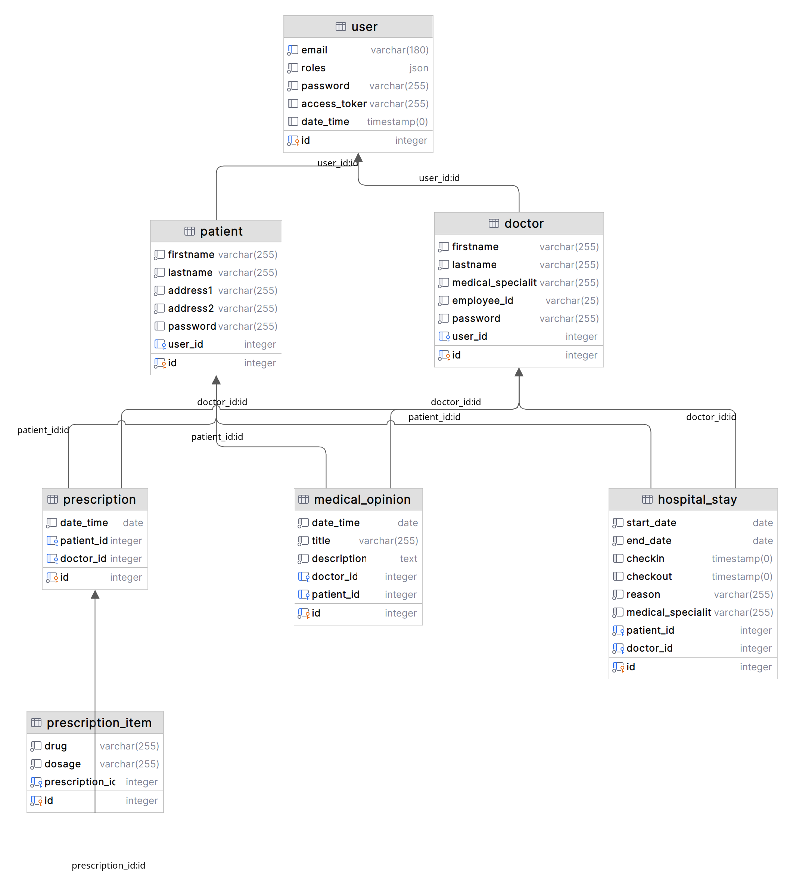

import Callout from '/src/components/Callout/Callout.astro'

<Callout>
Dans cet article je présente rapidement les compétences liées aux bases de données, mises en oeuvre dans mon projet de certification.
Cet article est le second d'une série de quatre articles qui décrivent mon dossier de projet professionnel.
</Callout>

Le premier post se trouve [ici](/posts/dossier-de-projet).

# Concevoir et développer la persistance des données

Le bloc de compétences s'intitule _Concevoir et développer la persistance des données en intégrant les recommandations de sécurité_. Il est composé de trois parties : [Concevoir une base de données](#concevoir-une-base-de-données), [Mettre en place une base de données](#mettre-en-place-une-base-de-données) et [Développer des composants dans le langage d'une base de données](#mettre-en-place-une-base-de-données).

Ce sont des compétences assez basiques, pour moi qui manipule les SGBD _MySQL_ et _MariaDB_ depuis des années. Pour le projet, j'ai choisi d'utiliser _PostgreSQL_, c'est le SGBD utilisé par défaut par Symfony. Comme indiqué dans ma note de pré-démarrage, je m'efforce de me conformer aux standards et aux configurations initiales de _Symfony_. Je n'avais jamais eu l'occasion de l'utiliser. C'était donc le bon moment, je disposais d'une marge de temps et c'est peu risqué (rejeté des risques, tant l'impact est faible).

## Concevoir une base de données

J'ai initialement conçu la base de données  dans phpstorm avec le plugin [plantuml](https://plantuml.com/fr/) mais le résultat n'était pas très satisfaisant. UML n'est pas fait pour représenter les bases de données. J'ai finalement utilisé [LucidChart](https://www.lucidchart.com/), comme recommandé dans les cours. Avec du recul et pour une prochaine fois, j'utiliserai peut-être [dbdiagram.io](https://dbdiagram.io/home) qui semble parfaitement adapté à la tâche.

Sur le fond, rien de très sorcier, c'est sans difficulté que j'ai conçu une base de données normalisée, avec les clés étrangères, des index pertinents. Le rendu ici n'est pas fameux, mais ça n'est pas très important, car ce schéma n'est pas un document de travail très utilisé, comme on va le voir.



Une chose n'apparait pas dans ce schéma, le fait qu'un _user_ peut également avoir un rôle  secrétaire ou administrateur. Ces utilisateurs n'ont pas de profil. On aurait pu le voir si on avait un type Enum pour les rôles dans le _user_, mais la norme dans le développement Symfony semble être de gérer les contraintes au niveau de l'entité Doctrine plus que dans la base de données.

<Callout title="Digression" icon="info">
  Par le passé, j'ai développé une petite application pour gérer un championnat de poker entre amis (tous les prétextes sont bons pour faire un petit projet de développement). J'avais pris l'option d'utiliser les fonctions avancées de la base de données, des vues, des procédures et des triggers. Coté connaissances, c'était très intéressant, coté architecture, organisation, c'est à proscrire car **la logique applicative est dispersée entre le code php et la base de données**.

1. La maintenance et les évolutions deviennent périlleuses, les migrations sur la base de données, sont couteuses, difficiles à tester, difficiles à corriger en production (ça peut arriver).
2. La compréhension du code est difficile, elle demande des compétences avancées en MySQL, et jongler en permanence entre code PHP et code SQL rend le travail pénible.

Bref, garder une base de données simple est un choix judicieux, en phase avec les pratiques et outils modernes. Faire autrement doit être précédé d'une contrainte très forte.
</Callout>

## Modélisation avec Doctrine

Une fois le Modèle Conceptuel de Données réalisé, la modélisation en classe écrite, j'ai concrétisé la conception par l'implémentation des entités Doctrine.

Voici un exemple d'entité représentant un séjour à l'hôpital :

```php
#[ORM\Entity(repositoryClass:HospitalStayRepository::class)]
classHospitalStay
{
    #[ORM\Id]
    #[ORM\GeneratedValue]
    #[ORM\Column]
    private ?int $id =null;

    #[ORM\Column(type:Types::DATETIME_MUTABLE,nullable:true)]
    private ?DateTimeInterface $checkin =null;

    #[ORM\ManyToOne(inversedBy: 'hospitalStays')]
    #[ORM\JoinColumn(nullable: false)]
    #[Groups(['hospital_stay:read', 'hospital_stay:details'])]
    private ?Patient $patient = null;

    // ...
}
```

Cette approche de modélisation via le code apporte au moins 2 avantages :

- Le code et la structure de la base de données sont définis ensemble
- L'IDE (phpstorm) aide à la saisie et à la validation du code, de la cohérence.

Il restait le problème des migrations, qui restent dissociées, mais j'ai intégré les commandes de migrations au processus de déploiement continue, ce qui règle le problème.

```yaml
  # déploiement
  deploy:
    steps:
        with:
          script: |
           // ...
            docker compose exec php ./bin/console doctrine:migrations:migrate --no-interaction --allow-no-migration
```
Le code en question est dans le [workflow de déploiement GitHub](https://github.com/SebSept/soignemoi-api/blob/dea5859c23cc8e80037de1ccaeb8d047abf15f3a/.github/workflows/deploy.yaml#L53).

## Mettre en place une base de données

Il s'agit d'une part d'installer et configurer un SGBD, de façon sécurisée. A nouveau avec Docker, c'est simple, j'ai pu me concentrer sur la sécurité.

La mise en place est réalisée par Doctrine en tenant compte des entités définies dans le code PHP. La création des tables est faite simplement avec la commande :

```bash
php bin/console doctrine:schema:create
```

Les migrations avec Doctrine sont simples car générées avec la commande

```bash
php bin/console make:migration
```

Doctrine compare alors le schéma actuel de la base avec le schéma décrit par les entités. Il génère le code nécessaire pour passer de l'un à l'autre.

Pour jouer les migrations et mettre à jour concrètement la base, on lance :

```bash
php bin/console doctrine:migrations:migrate
```

Ce processus rend l'évolution du schéma simple et sûre. On peut facilement revenir en arrière en annulant une migration si besoin.

Cette façon de faire nous éloigne des considérations purement d'écriture de code SQL, pour la validation de mes compétences, j'ai fait valoir mon expérience de développeur PrestaShop. J'ai écrit des migrations SQL _brute_ (ou presque) (création de tables, modification de champs, etc). J'ai écrit des scripts de migration de version de PHP, des scripts d'insertion de données dans le catalogue, _dumpé_ des bases ou des tables, mis en place des sauvegardes, procédé à des récupérations/injections partielles de données, beaucoup de tâches dans ce domaine. C'est pourquoi, j'ai pu utiliser Doctrine sans me préoccuper du travail directement au niveau SQL dans ce projet.

## Développer des composants dans le langage d'une base de données

À nouveau, pas d'écriture de SQL directement, les instructions les plus proches du langage sont des requêtes réalisées avec le QueryBuilder.
Voici un exemple de méthode dans un repository permettant de récupérer les séjours d'un médecin pour la journée courante :

```php
classHospitalStayRepository extendsServiceEntityRepository
{
    /**
     * @return array<HospitalStay>
     */
    public function findByDoctorForToday(int $doctor_id): array
    {
        return$this->createQueryBuilder('h')
            ->where('h.doctor = :doctor_id')
            ->andWhere('h.checkin IS NOT NULL')
            ->andWhere('h.checkout IS NULL')
            ->setParameter('doctor_id',$doctor_id)
            ->getQuery()
            ->getResult();
    }
}
```
C'est assez facile à écrire, on évite les erreurs de syntaxe _idiotes_ et le point intéressant, c'est qu'en utilisant la méthode `setParameter` pour définir les parties variables de la requête, on écrit du code sécurisé sans effort, on se protège des injections SQLs.
Les résultats sont directement retournés sous forme d'objets PHP (ici un tableau d'objets `HospitalStay`). Cette approche apporte une abstraction par rapport au SQL pur, tout en permettant d'écrire des requêtes complexes si nécessaire. Les avantages sont multiples :

- Le code est plus lisible et maintenable, proche du langage objet.
- On limite les erreurs liées à la construction manuelle de requêtes SQL.
- Le code est portable, indépendant du SGBD utilisé.
- Les performances sont optimisées, Doctrine génère des requêtes efficaces.

Savoir écrire du SQL c'est très bien, on est forçément amené le faire par moment, ça n'empêche pas d'utiliser des abstractions quand on peut.

## Conclusion

Le travail sur la persistance des données lors de ce projet m'a permis d'approfondir plusieurs aspects :

- La conception d'un schéma de base de données cohérent et normalisé
- La mise en place d'une base de données avec un processus d'évolution maîtrisé
- L'utilisation d'un ORM mature pour faciliter les interactions avec la base
- La prise en compte des aspects de sécurité (injection SQL, paramètres de requêtes)

Au-delà des compétences techniques, cette expérience a renforcé mon approche méthodologique et ma capacité à intégrer de nouveaux outils et pratiques de manière réfléchie et pragmatique. Choisir les bons outils, savoir quand utiliser ou non une fonctionnalité, comprendre les principes sous-jacents sont autant de réflexes qui font la différence dans la qualité et la maintenabilité des développements.

En résumé, ce projet a été l'occasion de monter en compétences sur la persistance des données de manière très concrète, en allant bien au-delà de la simple utilisation d'un SGBD. Cette expérience enrichissante servira de base solide pour les projets à venir.