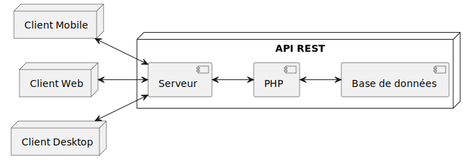

import Callout from '/src/components/Callout/Callout.astro'

<Callout>Dans ce troisième article explorant mon projet de certification, je présente les aspects de gestion de projet, de conception et de développement des composants métier. Cet article couvre une partie du bloc de compétences "Concevoir et développer une application multicouche répartie".</Callout>

## Stack technique

Le projet repose sur un ensemble de technologies modernes et éprouvées, choisies pour leur fiabilité et leur maintainabilité.
Tous ces choix ont fait l'objet d'une analyse et la délibération s'est faite en respectant les lignes directrices choisies en début de projet.

### Frameworks et composants principaux

- **Symfony 7** comme framework de base
- **API Platform** pour la couche API REST
- **PostgreSQL** comme SGBD
- **Docker** pour la conteneurisation
- **Flutter** pour l'application mobile
- **Electron** pour l'application desktop

### Infrastructure et déploiement

- **Nginx** comme serveur web
- **PHP-FPM** pour l'exécution PHP
- **Let's Encrypt** via Certbot pour les certificats SSL/TLS
- **GitHub Actions** & **Docker** pour l'intégration et le déploiement continu

### Tests et qualité

- **PHPUnit** pour les tests unitaires et fonctionnels
- Les composants [**zenstruck/browser**](https://github.com/zenstruck/browser) et [**zenstruck/foundry**](https://symfony.com/bundles/ZenstruckFoundryBundle/current/index.html) pour simplifier l'écriture des tests
- **PHP-CS-Fixer** pour le formatage du code selon les standards PSR
- **PHPStan** au niveau maximum pour l'analyse statique
- **Rector** pour la modernisation automatique du code
- **Docker Scout** pour l'analyse des vulnérabilités des conteneurs

Cette stack complète nous assure :
- Un développement standardisé et maintenable
- Une gestion des environnements reproductible
- Un processus de déploiement automatisé et sécurisé
- Une qualité de code constante

## La gestion du projet

Pour ce projet, j'ai mis en place une organisation structurée qui m'a permis de livrer une solution opérationnelle dans les délais. J'ai distingué trois grandes phases : préparation, développement et finalisation. Cette structuration m'a permis de bien cadrer le projet et ses livrables.

Dans la phase de développement, j'ai fait cohabiter deux approches méthodologiques :
- Une approche en cascade traditionnelle pour réaliser les fondations du projet.
- Une approche plus agile pour implémenter les améliorations et corrections.

Cette hybridation a constitué un excellent compromis : la gestion en cascade, avec ses délais déterminés, m'a permis d'assurer le respect des échéances et la couverture des exigences essentielles. L'approche agile adoptée ensuite s'est avérée plus adaptée pour implémenter les corrections et améliorations identifiées durant la première phase.

Pour suivre ces étapes, j'ai opté pour des outils simples et efficaces :
- Ganttproject pour le planning global
- Kanboard pour la gestion quotidienne des tâches

Ces choix, guidés par un besoin de simplicité (projet individuel), se sont révélés très pertinents pour maintenir le cap tout au long du développement.

## Conception de l'application

La phase de conception s'est naturellement appuyée sur les documents produits précédemment. Le cahier des charges a constitué une base solide pour définir l'architecture du système. Les points importants qui ont guidé la conception :

- Une architecture client/serveur classique et éprouvée
- Une API REST centrale servant plusieurs clients
- Une séparation nette des responsabilités facilitant l'évolution future

Cette architecture est représentée dans ce diagramme :



Le choix d'une API REST comme point central du système apporte plusieurs avantages :
- Une interface standardisée pour tous les clients
- Une évolution facilitée du côté client comme du côté serveur
- Une maintenance simplifiée par la séparation des responsabilités

## Développement des composants métier

Pour illustrer le développement des composants métier, prenons l'exemple d'un service gérant l'authentification.

```php
public function authenticateUser(string $email, string $password): ApiResponse
{
    try {
        $response = $this->httpClient->request(
            'POST',
            $this->apiUrl.'/token',
            [
                'json' => [
                    'email' => $email,
                    'password' => $password,
                ],
            ]);

        if (200 !== $response->getStatusCode()) {
            return new ApiResponse(ok: false);
        }

        /** @var object{accessToken: string, role: string, id: int} $json */
        $json = json_decode($response->getContent(), flags: JSON_THROW_ON_ERROR);
        // ...
```

Ce composant illustre bien l'approche adoptée :
- Une gestion claire des erreurs
- Un typage fort pour la sécurité
- Des retours explicites facilitant l'utilisation

La qualité du code est assurée par plusieurs mécanismes :
- Des tests unitaires systématiques
- Une vérification automatisée des vulnérabilités (composer audit)
- Une intégration continue validant chaque modification

On peut noter que la réponse négative l'api ne s'accompagne exceptionnellement d'aucun message. C'est une mesure de sécurité pour ne pas indiquer à quel niveau l'authentification a échoué.

Cette première partie illustre l'importance d'une organisation rigoureuse et d'une conception réfléchie pour la réussite du projet.

Le [prochain article](/posts/competences-titre-pro-4-4) évoque les aspects de tests, de déploiement et de mise en production.